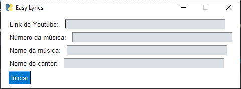

# Easy Lyrics
<h2>Criação de slides e download de músicas</h2>

Easy Lyrics foi criado para facilitar a criação letras de música para a minha igreja (Igreja Batista Novos Começos).

Ele não faz tudo automaticamente, mas acelera uma boa parte do processo.
Você ainda precisa verificar os slides para centralizar os textos.

Para instalar as dependências execute o seguinte comando no terminal:

<code>pip install -r requirements.txt</code>

<h3>Uso:</h3>

Depois de instalar as dependências execute o seguinte comando no terminal:

<code>python app.py</code>

Abrira uma janela, preencha e aperte o botão iniciar.

E pronto, o arquivo do PowerPoint e a música no formato MP4 estará na pasta louvores.
